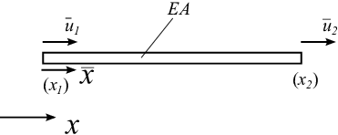

bar1e - One dimensional bar element
^^^^^^^^^^^^^^^^^^^^^^^^^^^^^^^^^^^

.. index:: bar1e

**Purpose**

Compute element stiffness matrix for a one dimensional bar element.

**Syntax**

.. code-block:: matlab

    Ke = bar1e(ex, ep)
    [Ke, fe] = bar1e(ex, ep, eq)

**Description**

``bar1e`` provides the element stiffness matrix ``Ke`` for a one dimensional bar element.
The input variables

.. math::

    \text{ex} = [x_1 \;\; x_2]
    \qquad
    \text{ep} = [E \; A]

supply the element nodal coordinates :math:`x_1` and :math:`x_2`, the modulus of elasticity :math:`E`,
and the cross section area :math:`A`.

The element load vector ``fe`` can also be computed if a uniformly distributed load is applied to the element.
The optional input variable

.. math::

    \text{eq} = [q_{\bar{x}}]

contains the distributed load per unit length, :math:`q_{\bar{x}}`.

.. figure:: images/bar1e_2.png
    :align: center
    :width: 70%

**Theory**

The element stiffness matrix :math:`\bar{\mathbf{K}}^e`, stored in ``Ke``, is computed according to

.. math::

    \bar{\mathbf{K}}^e = \frac{D_{EA}}{L}
    \begin{bmatrix}
    1 & -1 \\
    -1 & 1
    \end{bmatrix}

where the axial stiffness :math:`D_{EA}` and the length :math:`L` are given by

.. math::

    D_{EA} = EA; \quad L = x_2 - x_1

The element load vector :math:`\bar{\mathbf{f}}_l^e`, stored in ``fe``, is computed according to

.. math::

    \bar{\mathbf{f}}_l^e = \frac{q_{\bar{x}} L}{2}
    \begin{bmatrix}
    1 \\
    1
    \end{bmatrix}