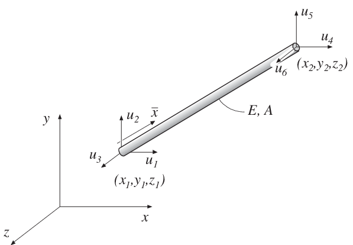

bar3e - Three dimensional bar element
^^^^^^^^^^^^^^^^^^^^^^^^^^^^^^^^^^^^^

.. index:: bar3e

**Purpose**

Compute element stiffness matrix for a three dimensional bar element.

**Syntax**

.. code-block:: matlab

    Ke = bar3e(ex, ey, ez, ep)
    [Ke, fe] = bar3e(ex, ey, ez, ep, eq)

**Description**

``bar3e`` provides the global element stiffness matrix ``Ke`` for a three dimensional bar element.

The input variables

.. math::

    \begin{array}{l}
    \mathrm{ex} = [x_1 \;\; x_2] \\
    \mathrm{ey} = [y_1 \;\; y_2] \\
    \mathrm{ez} = [z_1 \;\; z_2]
    \end{array}
    \qquad
    \mathrm{ep} = [E \;\; A]

supply the element nodal coordinates :math:`x_1`, :math:`y_1`, :math:`z_1`, :math:`x_2`, :math:`y_2`, and :math:`z_2`, the modulus of elasticity :math:`E`, and the cross section area :math:`A`.

The element load vector ``fe`` can also be computed if a uniformly distributed axial load is applied to the element. The optional input variable

.. math::

    \mathrm{eq} = [q_{\bar{x}}]

contains the distributed load per unit length, :math:`q_{\bar{x}}`.

**Theory**

The element stiffness matrix :math:`\mathbf{K}^e`, stored in ``Ke``, is computed according to

.. math::

    \mathbf{K}^e = \mathbf{G}^T \; \bar{\mathbf{K}}^e \; \mathbf{G}

where

.. math::

    \bar{\mathbf{K}}^e = \frac{D_{EA}}{L}
    \begin{bmatrix}
    1 & -1 \\
    -1 & 1
    \end{bmatrix}
    \qquad
    \mathbf{G} =
    \begin{bmatrix}
    n_{x\bar{x}} & n_{y\bar{x}} & n_{z\bar{x}} & 0 & 0 & 0 \\
    0 & 0 & 0 & n_{x\bar{x}} & n_{y\bar{x}} & n_{z\bar{x}}
    \end{bmatrix}

where the axial stiffness :math:`D_{EA}` and the length :math:`L` are given by

.. math::

    D_{EA} = EA \qquad
    L = \sqrt{(x_2 - x_1)^2 + (y_2 - y_1)^2 + (z_2 - z_1)^2}

and the transformation matrix :math:`\mathbf{G}` contains the direction cosines

.. math::

    n_{x\bar{x}} = \frac{x_2 - x_1}{L} \qquad
    n_{y\bar{x}} = \frac{y_2 - y_1}{L} \qquad
    n_{z\bar{x}} = \frac{z_2 - z_1}{L}

The element load vector :math:`\mathbf{f}_l^e`, stored in ``fe``, is computed according to

.. math::

    \mathbf{f}_l^e = \mathbf{G}^T \; \bar{\mathbf{f}}_l^e

where

.. math::

    \bar{\mathbf{f}}_l^e = \frac{q_{\bar{x}} L}{2}
    \begin{bmatrix}
    1 \\
    1
    \end{bmatrix}
