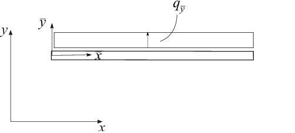

.. index:: beam1e

beam1we - One dimensional beam element with elastic support
-----------------------------------------------------------

Purpose
^^^^^^^

Compute element stiffness matrix for a one dimensional beam element on elastic support.

.. figure:: images/beam1w.png
    :align: center

Syntax
^^^^^^

.. code-block:: matlab

    Ke = beam1we(ex, ep)
    [Ke, fe] = beam1we(ex, ep, eq)

Description
^^^^^^^^^^^

**beam1we** provides the global element stiffness matrix **Ke** for a one dimensional beam element with elastic support.

The input variables

.. math::

    \mathrm{ex} = [x_1 \;\; x_2]
    \qquad
    \mathrm{ep} = [E\;\; I \;\; k_{\bar{y}}]

supply the element nodal coordinates :math:`x_1` and :math:`x_2`, the modulus of elasticity :math:`E`, the moment of inertia :math:`I`, and the spring stiffness in the transverse direction :math:`k_{\bar{y}}`.

The element load vector **fe** can also be computed if a uniformly distributed load is applied to the element. The optional input variable

.. math::

    \mathrm{eq} = \begin{bmatrix} q_{\bar{y}} \end{bmatrix}

contains the distributed load per unit length, :math:`q_{\bar{y}}`.

Theory
^^^^^^

The element stiffness matrix :math:`\bar{\mathbf{K}}^e`, stored in **Ke**, is computed according to

.. math::

    \bar{\mathbf{K}}^e = \bar{\mathbf{K}}^e_0 + \bar{\mathbf{K}}^e_s

where

.. math::

    \bar{\mathbf{K}}^e_0 = \frac{D_{EI}}{L^3}
    \begin{bmatrix}
        12 & 6L & -12 & 6L \\
        6L & 4L^2 & -6L & 2L^2 \\
        -12 & -6L & 12 & -6L \\
        6L & 2L^2 & -6L & 4L^2
    \end{bmatrix}

and

.. math::

    \bar{\mathbf{K}}^e_s = \frac{k_{\bar{y}} L}{420}
    \begin{bmatrix}
        156 & 22L & 54 & -13L \\
        22L & 4L^2 & 13L & -3L^2 \\
        54 & 13L & 156 & -22L \\
        -13L & -3L^2 & -22L & 4L^2
    \end{bmatrix}

where the bending stiffness :math:`D_{EI}` and the length :math:`L` are given by

.. math::

    D_{EI} = EI \qquad L = x_2 - x_1

The element loads :math:`\bar{\mathbf{f}}_l^e` stored in the variable **fe** are computed according to

.. math::

    \bar{\mathbf{f}}_l^e = q_{\bar{y}}
    \begin{bmatrix}
        \dfrac{L}{2} \\
        \dfrac{L^2}{12} \\
        \dfrac{L}{2} \\
        -\dfrac{L^2}{12}
    \end{bmatrix}