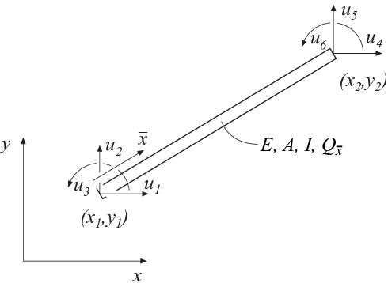

beam2ge - Two dimensional geometric nonlinear beam element
----------------------------------------------------------

Purpose:
^^^^^^^^

Compute element stiffness matrix for a two dimensional nonlinear beam element with respect to geometrical nonlinearity.

Syntax:
^^^^^^^

.. code-block:: matlab

    Ke = beam2ge(ex, ey, ep, Qx)
    [Ke, fe] = beam2ge(ex, ey, ep, Qx, eq)

Description:
^^^^^^^^^^^^

``beam2ge`` provides the global element stiffness matrix ``Ke`` for a two dimensional beam element with respect to geometrical nonlinearity.

The input variables:

- ``ex = [x1 x2]``
- ``ey = [y1 y2]``
- ``ep = [E A I]``

supply the element nodal coordinates ``x1``, ``y1``, ``x2``, and ``y2``, the modulus of elasticity ``E``, the cross section area ``A``, and the moment of inertia ``I``.

- ``Qx = [Q_xbar]``

contains the value of the predefined axial force ``Q_xbar``, which is positive in tension.

The element load vector ``fe`` can also be computed if a uniformly distributed transverse load is applied to the element. The optional input variable

- ``eq = [q_ybar]``

contains the distributed transverse load per unit length, ``q_ybar``. Note that ``eq`` is a scalar and not a vector as in ``beam2e``.

Theory:
^^^^^^^

The element stiffness matrix :math:`\mathbf{K}^e`, stored in the variable ``Ke``, is computed according to

.. math::

    \mathbf{K}^e = \mathbf{G}^T \bar{\mathbf{K}}^e \mathbf{G}

where :math:`\bar{\mathbf{K}}^e` is given by

.. math::

    \bar{\mathbf{K}}^e = \bar{\mathbf{K}}^e_0 + \bar{\mathbf{K}}^e_{\sigma}

with

.. math::

    \bar{\mathbf{K}}^e_0 = \begin{bmatrix}
    \frac{D_{EA}}{L} & 0 & 0 & -\frac{D_{EA}}{L} & 0 & 0 \\
    0 & \frac{12 D_{EI}}{L^3} & \frac{6 D_{EI}}{L^2} & 0 & -\frac{12 D_{EI}}{L^3} & \frac{6 D_{EI}}{L^2} \\
    0 & \frac{6 D_{EI}}{L^2} & \frac{4 D_{EI}}{L} & 0 & -\frac{6 D_{EI}}{L^2} & \frac{2 D_{EI}}{L} \\
    -\frac{D_{EA}}{L} & 0 & 0 & \frac{D_{EA}}{L} & 0 & 0 \\
    0 & -\frac{12 D_{EI}}{L^3} & -\frac{6 D_{EI}}{L^2} & 0 & \frac{12 D_{EI}}{L^3} & -\frac{6 D_{EI}}{L^2} \\
    0 & \frac{6 D_{EI}}{L^2} & \frac{2 D_{EI}}{L} & 0 & -\frac{6 D_{EI}}{L^2} & \frac{4 D_{EI}}{L}
    \end{bmatrix}

.. math::

    \bar{\mathbf{K}}^e_{\sigma} = Q_{\bar{x}} \begin{bmatrix}
    0 & 0 & 0 & 0 & 0 & 0 \\
    0 & \frac{6}{5L} & \frac{1}{10} & 0 & -\frac{6}{5L} & \frac{1}{10} \\
    0 & \frac{1}{10} & \frac{2L}{15} & 0 & -\frac{1}{10} & -\frac{L}{30} \\
    0 & 0 & 0 & 0 & 0 & 0 \\
    0 & -\frac{6}{5L} & -\frac{1}{10} & 0 & \frac{6}{5L} & -\frac{1}{10} \\
    0 & \frac{1}{10} & -\frac{L}{30} & 0 & -\frac{1}{10} & \frac{2L}{15}
    \end{bmatrix}

.. math::

    \mathbf{G} = \begin{bmatrix}
    n_{x\bar{x}} & n_{y\bar{x}} & 0 & 0 & 0 & 0 \\
    n_{x\bar{y}} & n_{y\bar{y}} & 0 & 0 & 0 & 0 \\
    0 & 0 & 1 & 0 & 0 & 0 \\
    0 & 0 & 0 & n_{x\bar{x}} & n_{y\bar{x}} & 0 \\
    0 & 0 & 0 & n_{x\bar{y}} & n_{y\bar{y}} & 0 \\
    0 & 0 & 0 & 0 & 0 & 1
    \end{bmatrix}

where the axial stiffness :math:`D_{EA}`, the bending stiffness :math:`D_{EI}` and the length :math:`L` are given by

.. math::

    D_{EA} = EA;\quad D_{EI} = EI;\quad L = \sqrt{(x_2 - x_1)^2 + (y_2 - y_1)^2}

The transformation matrix :math:`\mathbf{G}` contains the direction cosines

.. math::

    n_{x\bar{x}} = n_{y\bar{y}} = \frac{x_2 - x_1}{L} \qquad
    n_{y\bar{x}} = -n_{x\bar{y}} = \frac{y_2 - y_1}{L}

The element loads :math:`\mathbf{f}^e_l` stored in ``fe`` are computed according to

.. math::

    \mathbf{f}^e_l = \mathbf{G}^T \bar{\mathbf{f}}^e_l

where

.. math::

    \bar{\mathbf{f}}^e_l = q_{\bar{y}} \begin{bmatrix} 0 \\ \frac{L}{2} \\ \frac{L^2}{12} \\ 0 \\ \frac{L}{2} \\ -\frac{L^2}{12} \end{bmatrix}
