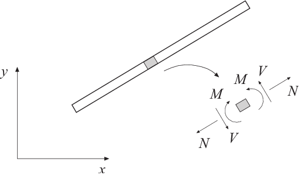

beam2ts - Two dimensional Timoshenko beam element
-------------------------------------------------

Purpose
^^^^^^^

Compute section forces in a two dimensional Timoshenko beam element.

    Section forces

Syntax
^^^^^^

.. code-block:: matlab

    es = beam2ts(ex, ey, ep, ed)
    es = beam2ts(ex, ey, ep, ed, eq)
    [es, edi, eci] = beam2ts(ex, ey, ep, ed, eq, n)

Description
^^^^^^^^^^^

``beam2ts`` computes the section forces and displacements in local directions
along the beam element ``beam2te``.

The input variables ``ex``, ``ey``, ``ep`` and ``eq`` are defined in
``beam2te``. The element displacements, stored
in ``ed``, are obtained by the function ``extract``.
If distributed loads are applied to the element, the variable ``eq`` must be
included.
The number of evaluation points for section forces and displacements are
determined by ``n``. If ``n`` is omitted, only the ends of the
beam are evaluated.

The output variables

.. math::

    \begin{aligned}
    \mathrm{es} &= \left[\; \mathbf{N} \; \mathbf{V} \; \mathbf{M}\; \right] \\
    \mathrm{edi} &= \left[\; \mathbf{u} \; \mathbf{v} \; \boldsymbol{\theta} \; \right] \\
    \mathrm{eci} &= \left[ \mathbf{\bar{x}} \right]
    \end{aligned}

consist of column matrices that contain
the section forces, the displacements and rotation of the cross section
(note that the rotation :math:`\theta` is not equal to
:math:`\frac{d\bar v}{d\bar x}`),
and the evaluation points on the local :math:`\bar{x}`-axis.
The explicit matrix expressions are

.. math::

    \mathrm{es} =
    \begin{bmatrix}
     N_{1} & V_{1}  & M_{1}  \\
     N_{2} & V_{2}  & M_{2}  \\
     \vdots    &\vdots   &\vdots   \\
     N_{n}  & V_{n}  & M_{n}
    \end{bmatrix}
    \qquad
    \mathrm{edi} =
    \begin{bmatrix}
    u_{1} & v_{1} & \theta_1   \\
    u_{2} & v_{2} & \theta_2 \\
    \vdots  & \vdots & \vdots   \\
    u_{n} & v_{n} & \theta_n
    \end{bmatrix}
    \qquad
    \mathrm{eci} =
    \begin{bmatrix}
    0  \\
    \bar x_{2} \\
    \vdots   \\
    \bar x_{n-1} \\
    L
    \end{bmatrix}

where :math:`L` is the length of the beam element.

Theory
^^^^^^

The nodal displacements in local coordinates are given by

.. math::

    \mathbf{\bar{a}}^e =
    \begin{bmatrix}
    \bar{u}_1 \\ \bar{u}_2 \\ \bar{u}_3 \\ \bar{u}_4 \\ \bar{u}_5 \\ \bar{u}_6
    \end{bmatrix}
    = \mathbf{G} \mathbf{a}^e

where :math:`\mathbf{G}` is described in ``beam2e``
and the transpose of :math:`\mathbf{a}^e` is stored in ``ed``.
The displacements associated with bar action and beam action are determined as

.. math::

    \mathbf{\bar{a}}^e_{\mathrm{bar}} =
    \begin{bmatrix} \bar{u}_1 \\ \bar{u}_4 \end{bmatrix}
    \qquad
    \mathbf{\bar{a}}^e_{\mathrm{beam}} =
    \begin{bmatrix} \bar{u}_2 \\ \bar{u}_3 \\ \bar{u}_5 \\ \bar{u}_6 \end{bmatrix}

The displacement :math:`u(\bar{x})` and the normal force :math:`N(\bar{x})` are computed from

.. math::

    u(\bar{x}) = \mathbf{N}_{\mathrm{bar}} \mathbf{\bar{a}}^e_{\mathrm{bar}} + u_p(\bar{x})

.. math::

    N(\bar{x}) = D_{EA} \mathbf{B}_{\mathrm{bar}} \mathbf{\bar{a}}^e + N_p(\bar{x})

where

.. math::

    \mathbf{N}_{\mathrm{bar}} = \begin{bmatrix} 1 & \bar{x} \end{bmatrix} \mathbf{C}^{-1}_{\mathrm{bar}} = \begin{bmatrix} 1-\frac{\bar{x}}{L} & \frac{\bar{x}}{L} \end{bmatrix}

.. math::

    \mathbf{B}_{\mathrm{bar}} = \begin{bmatrix} 0 & 1 \end{bmatrix} \mathbf{C}^{-1}_{\mathrm{bar}} = \begin{bmatrix} -\frac{1}{L} & \frac{1}{L} \end{bmatrix}

.. math::

    u_p(\bar{x}) = -\frac{q_{\bar{x}}}{D_{EA}}\left(\frac{\bar{x}^2}{2}-\frac{L\bar{x}}{2}\right)

.. math::

    N_p(\bar{x}) = -q_{\bar{x}}\left(\bar{x}-\frac{L}{2}\right)

in which :math:`D_{EA}`, :math:`L`, and :math:`q_{\bar{x}}`
are defined in ``beam2te`` and

.. math::

    \mathbf{C}^{-1}_{\mathrm{bar}} =
    \begin{bmatrix}
    1 & 0 \\
    -\frac{1}{L} & \frac{1}{L}
    \end{bmatrix}

The displacement :math:`v(\bar{x})`, the rotation :math:`\theta(\bar{x})`, the bending moment :math:`M(\bar{x})` and the shear force :math:`V(\bar{x})` are computed from

.. math::

    v(\bar{x}) = \mathbf{N}_{\mathrm{beam},v} \mathbf{\bar{a}}^e_{\mathrm{beam}} + v_p(\bar{x})

.. math::

    \theta(\bar{x}) = \mathbf{N}_{\mathrm{beam},\theta} \mathbf{\bar{a}}^e_{\mathrm{beam}} + \theta_p(\bar{x})

.. math::

    M(\bar{x}) = D_{EI} \frac{d\theta}{dx} = D_{EI} \frac{d\mathbf{N}_{\mathrm{beam},\theta}}{d\bar{x}} \mathbf{\bar{a}}^e_{\mathrm{beam}} + M_p(\bar{x})

.. math::

    V(\bar{x}) = D_{GA} k_s \left(\frac{d v}{dx} - \theta \right) = D_{GA} k_s \left(\frac{d\mathbf{N}_{\mathrm{beam},v}}{d\bar{x}} - \mathbf{N}_{\mathrm{beam},\theta} \right) \mathbf{\bar{a}}^e_{\mathrm{beam}} + V_p(\bar{x})

where

.. math::

    \mathbf{N}_{\mathrm{beam},v} = \begin{bmatrix} 1 & \bar{x} & \bar{x}^2 & \bar{x}^3 \end{bmatrix} \mathbf{C}^{-1}_{\mathrm{beam}}

.. math::

    \frac{d\mathbf{N}_{\mathrm{beam},v}}{d\bar{x}} = \begin{bmatrix} 0 & 1 & 2\bar{x} & 3\bar{x}^2 \end{bmatrix} \mathbf{C}^{-1}_{\mathrm{beam}}

.. math::

    \mathbf{N}_{\mathrm{beam},\theta} = \begin{bmatrix} 0 & 1 & 2\bar{x} & 3\bar{x}^2 + 6\alpha \end{bmatrix} \mathbf{C}^{-1}_{\mathrm{beam}}

.. math::

    \frac{d\mathbf{N}_{\mathrm{beam},\theta}}{d\bar{x}} = \begin{bmatrix} 0 & 0 & 2 & 6\bar{x} \end{bmatrix} \mathbf{C}^{-1}_{\mathrm{beam}}

.. math::

    v_p(\bar{x}) = \frac{q_{\bar{y}}}{D_{EI}}\left(\frac{\bar{x}^4}{24} - \frac{L\bar{x}^3}{12} + \frac{L^2\bar{x}^2}{2}\right) + \frac{q_{\bar{y}}}{D_{GA}k_s}\left(-\frac{\bar{x}^2}{2} + \frac{L\bar{x}}{2}\right)

.. math::

    \theta_p(\bar{x}) = \frac{q_{\bar{y}}}{D_{EI}}\left(\frac{\bar{x}^3}{6} - \frac{L\bar{x}^2}{4} + \frac{L^2\bar{x}}{12}\right)

.. math::

    M_p(\bar{x}) = q_{\bar{y}}\left(\frac{\bar{x}^2}{2} - \frac{L\bar{x}}{2} + \frac{L^2}{12}\right)

.. math::

    V_p(\bar{x}) = -q_{\bar{y}}\left(\bar{x} - \frac{L}{2}\right)

in which :math:`D_{EI}`, :math:`D_{GA}`, :math:`k_s`, :math:`L`, and :math:`q_{\bar{y}}`
are defined in ``beam2te`` and

.. math::

    \mathbf{C}^{-1}_{\mathrm{beam}} = \frac{1}{L^2 + 12\alpha}
    \begin{bmatrix}
    L^2 + 12\alpha & 0 & 0 & 0 \\
    -\frac{12\alpha}{L} & L^2 + 6\alpha & \frac{12\alpha}{L} & -6\alpha \\
    -3 & -2L - \frac{6\alpha}{L} & 3 & -L + \frac{6\alpha}{L} \\
    \frac{2}{L} & 1 & -\frac{2}{L} & 1
    \end{bmatrix}

with

.. math::

    \alpha = \frac{D_{EI}}{D_{GA} k_s}
