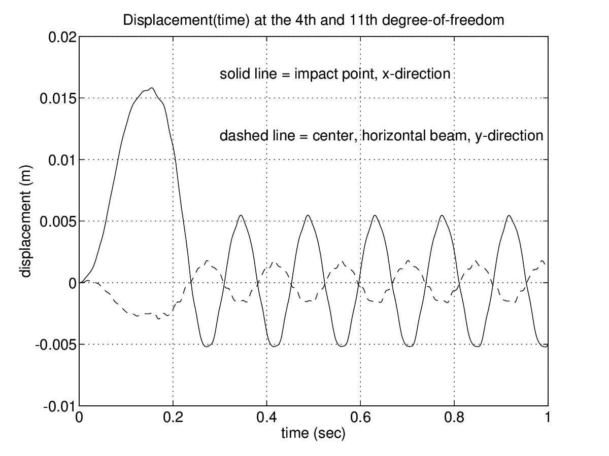
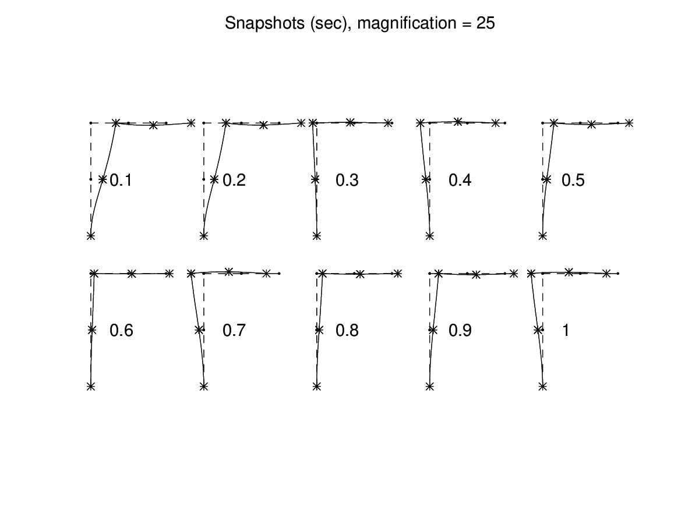

exd_beam2_t
^^^^^^^^^^^^

.. index:: exd_beam2_t

:Purpose:

    The frame structure defined in **exd_beam2_m** is exposed in this
    example to a transient load.
    The structural response is determined by a time stepping procedure.

:Description:

    The structure is exposed to a transient load,
    impacting on the center of the vertical beam in horizontal
    direction, i.e. at the 4th degree-of-freedom.
    The time history of the load is shown below. The result shall
    be displayed as time history plots of the 4th degree-of-freedom
    and the 11th degree-of-freedom.
    At time :math:`t=0` the frame is at rest. The timestep
    is chosen as :math:`\Delta t= 0.001` seconds and the integration
    is performed for :math:`T=1.0` second.
    At every 0.1 second the deformed shape of the whole structure shall
    be displayed.

    .. figure:: images/EXD2f1.png
        :align: center
        :width: 70%

        Time history of the impact load

    The load is generated using the **gfunc**-function.
    The time integration is performed by the **step2**-function.
    Because there is no damping present, the **C**-matrix is entered as **[ ]**.

.. code-block:: matlab

    dt=0.005;    T=1;
    % --- the load -----------------------------------------------
    G=[0 0; 0.15 1; 0.25 0; T 0];   [t,g]=gfunc(G,dt);
    f=zeros(15, length(g));       f(4,:)=1000*g;
    % --- boundary condition, initial condition ------------------
    bc=[1 0; 2 0; 3 0; 14 0];
    a0=zeros(15,1);               da0=zeros(15,1);
    % --- output parameters --------------------------------------
    times=[0.1:0.1:1];           dofs=[4 11];
    % --- time integration parameters ----------------------------
    ip=[dt T 0.25 0.5];
    % --- time integration ---------------------------------------
    k=sparse(K);                  m=sparse(M);
    [a,da,d2a,ahist,dahist,d2ahist]...
    =step2(k,[],m,f,a0,da0,bc,ip,times,dofs);

The requested time history plots are generated by the following commands

.. code-block:: matlab

    figure(1), plot(t,ahist(1,:),'-',t,ahist(2,:),'--')
    grid, xlabel('time (sec)'), ylabel('displacement (m)')
    title('Displacement(time) for the 4th and 11th'...
          ' degree-of-freedom')
    text(0.3,0.009,'solid line = impact point, x-direction')
    text(0.3,0.007,'dashed line = center, horizontal beam,'...
                   ' y-direction')

    Time history at DOF 4 and DOF 11.

The deformed shapes at time increment 0.1 sec
are stored in **a**. They are visualized
by the following commands:

.. code-block:: matlab

    figure(2),clf, axis('equal'), hold on, axis off
    sfac=25;
    title('Snapshots (sec), magnification = 25');
    for i=1:5;
      Ext=Ex+(i-1)*3;            eldraw2(Ext,Ey,[2 3 0]);
      Edb=extract_ed(Edof,a(:,i));
      eldisp2(Ext,Ey,Edb,[1 2 2],sfac);
      Time=num2str(times(i));   text(3*(i-1)+.5,1.5,Time);
    end;

.. code-block:: matlab

    Eyt=Ey-4;
    for i=6:10;
      Ext=Ex+(i-6)*3;            eldraw2(Ext,Eyt,[2 3 0]);
      Edb=extract_ed(Edof,a(:,i));
      eldisp2(Ext,Eyt,Edb,[1 2 2],sfac);
      Time=num2str(times(i));   text(3*(i-6)+.5,-2.5,Time);
    end

    Snapshots of the deformed geometry for every 0.1 sec.
