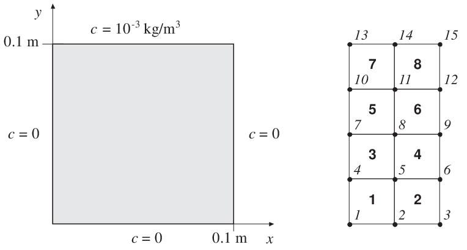
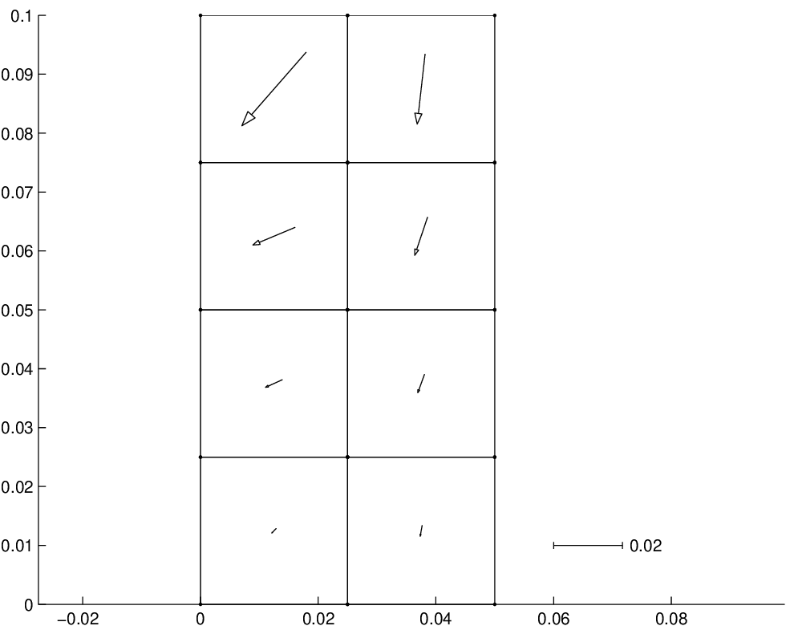
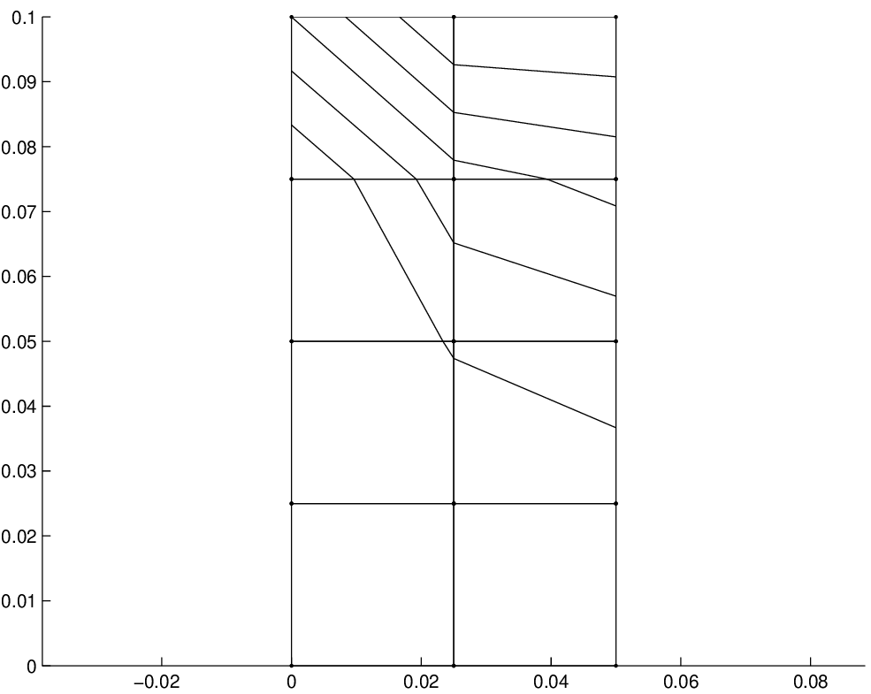

exs_flw_diff2
^^^^^^^^^^^^^

:Purpose: Show how to solve a two dimensional diffusion problem.

:Description: Consider a filter paper of square shape. Three sides are in contact with pure water and the fourth side is in contact with a solution of concentration :math:`c=1.0 \cdot 10^{-3}` kg/m³. The length of each side is 0.100 m. Using symmetry, only half of the paper has to be analyzed. The paper and the corresponding finite element mesh are shown. The following boundary conditions are applied:

:Example: The computation is initialized by importing CALFEM and NumPy. The element topology matrix contains only the degrees of freedom for each quadrilateral element:

.. code-block:: python

   >>> import numpy as np
   >>> import calfem.core as cfc
   >>> 
   >>> # Element topology matrix (DOFs only, no element numbers)
   >>> # Each row represents one quadrilateral element with 4 nodes
   >>> Edof = np.array([
   ...     [1, 2, 5, 4],      # Element 1
   ...     [2, 3, 6, 5],      # Element 2
   ...     [4, 5, 8, 7],      # Element 3
   ...     [5, 6, 9, 8],      # Element 4
   ...     [7, 8, 11, 10],    # Element 5
   ...     [8, 9, 12, 11],    # Element 6
   ...     [10, 11, 14, 13],  # Element 7
   ...     [11, 12, 15, 14]   # Element 8
   ... ])

The global system matrices are initialized:

.. code-block:: python

   >>> # Initialize global system (15 DOFs for concentration field)
   >>> K = np.zeros((15, 15))  # Global conductivity matrix
   >>> f = np.zeros(15)        # Global source vector (no sources in this problem)
   >>> print("Global system initialized with 15 DOFs")
   Global system initialized with 15 DOFs

Because all elements have the same geometry, orientation, and material properties, only one element conductivity matrix needs to be computed using :func:`flw2qe`:

.. code-block:: python

   >>> # Element properties and material matrix
   >>> ep = 1                    # Thickness [m]
   >>> D = np.array([[1, 0],     # Diffusion/conductivity matrix [m²/s]
   ...               [0, 1]])
   >>> 
   >>> # Element coordinates for standard element (0.025 × 0.025 m)
   >>> ex = np.array([0, 0.025, 0.025, 0])      # x-coordinates [m]
   >>> ey = np.array([0, 0, 0.025, 0.025])      # y-coordinates [m]
   >>> 
   >>> # Compute element conductivity matrix
   >>> Ke = cfc.flw2qe(ex, ey, ep, D)
   >>> print("Element conductivity matrix:")
   >>> print(Ke)
   [[ 0.75  -0.25  -0.25  -0.25]
    [-0.25   0.75  -0.25  -0.25]
    [-0.25  -0.25   0.75  -0.25]
    [-0.25  -0.25  -0.25   0.75]]

The global conductivity matrix is assembled by adding the element matrix to each element location:

.. code-block:: python

   >>> # Assemble global conductivity matrix
   >>> for i in range(8):  # 8 elements
   ...     K = cfc.assem(Edof[i], K, Ke)
   >>> 
   >>> print("Global conductivity matrix assembled successfully")
   Global conductivity matrix assembled successfully

The boundary conditions are applied and the system is solved. The boundary condition at DOF 13 is set to 0.5×10⁻³ as an average of neighboring boundary concentrations:

.. code-block:: python

   >>> # Boundary conditions (prescribed concentrations)
   >>> bc = np.array([
   ...     [1, 0],        # DOF 1 = 0 (pure water boundary)
   ...     [2, 0],        # DOF 2 = 0 (pure water boundary)
   ...     [3, 0],        # DOF 3 = 0 (pure water boundary)
   ...     [4, 0],        # DOF 4 = 0 (pure water boundary)
   ...     [7, 0],        # DOF 7 = 0 (pure water boundary)
   ...     [10, 0],       # DOF 10 = 0 (pure water boundary)
   ...     [13, 0.5e-3],  # DOF 13 = 0.5×10⁻³ kg/m³ (average concentration)
   ...     [14, 1e-3],    # DOF 14 = 1.0×10⁻³ kg/m³ (solution boundary)
   ...     [15, 1e-3]     # DOF 15 = 1.0×10⁻³ kg/m³ (solution boundary)
   ... ])
   >>> 
   >>> # Solve for concentrations and boundary fluxes
   >>> a, r = cfc.solveq(K, f, bc)
   >>> print("Concentrations [kg/m³]:")
   >>> print(a)
   >>> print("Boundary fluxes [kg/m²/s]:")  
   >>> print(r)

The element flux vectors are calculated from element concentrations using :func:`flw2qs`:

.. code-block:: python

   >>> # Extract element concentrations
   >>> Ed = cfc.extract_ed(Edof, a)
   >>> 
   >>> # Compute element flux vectors for all elements
   >>> Es = np.zeros((8, 2))  # Store flux vectors for 8 elements
   >>> for i in range(8):
   ...     Es[i] = cfc.flw2qs(ex, ey, ep, D, Ed[i])
   >>> 
   >>> print("Element flux vectors [kg/m²/s]:")
   >>> for i in range(8):
   ...     print(f"Element {i+1}: qx = {Es[i,0]:.6f}, qy = {Es[i,1]:.6f}")

**Results:**

The solution demonstrates the expected concentration distribution and flux patterns:

.. code-block:: text

   Element flux vectors [kg/m²/s]:
   Element 1: qx = -0.001300, qy = -0.001300
   Element 2: qx = -0.000500, qy = -0.003200
   Element 3: qx = -0.004900, qy = -0.002200
   Element 4: qx = -0.002000, qy = -0.005400
   Element 5: qx = -0.012200, qy = -0.005100
   Element 6: qx = -0.003700, qy = -0.011100
   Element 7: qx = -0.018700, qy = -0.021300
   Element 8: qx = -0.002300, qy = -0.020300
   
.. code-block:: python

   >>> # Summary of key results
   >>> print("\\nConcentration field [×10⁻³ kg/m³]:")
   >>> print(f"Pure water boundaries (DOFs 1-4,7,10): 0.000")
   >>> print(f"Internal concentrations:")
   >>> print(f"  DOF 5: {a[4]*1000:.3f}")
   >>> print(f"  DOF 6: {a[5]*1000:.3f}") 
   >>> print(f"  DOF 8: {a[7]*1000:.3f}")
   >>> print(f"  DOF 9: {a[8]*1000:.3f}")
   >>> print(f"  DOF 11: {a[10]*1000:.3f}")
   >>> print(f"  DOF 12: {a[11]*1000:.3f}")
   >>> print(f"Solution boundaries (DOFs 14,15): 1.000")
   
.. code-block:: text

   Concentration field [×10⁻³ kg/m³]:
   Pure water boundaries (DOFs 1-4,7,10): 0.000
   Internal concentrations:
     DOF 5: 0.066
     DOF 6: 0.094
     DOF 8: 0.179
     DOF 9: 0.250
     DOF 11: 0.434
     DOF 12: 0.549
   Solution boundaries (DOFs 14,15): 1.000

An alternative approach using global coordinates and automatic mesh generation, with visualization of flux vectors and contour lines:

.. code-block:: python

   >>> # Alternative approach using global coordinates
   >>> import calfem.vis_mpl as cfv
   >>> import matplotlib.pyplot as plt
   >>> 
   >>> # Global coordinate matrix and DOF numbering
   >>> Coord = np.array([
   ...     [0,     0    ], [0.025, 0    ], [0.05,  0    ],   # Row 1
   ...     [0,     0.025], [0.025, 0.025], [0.05,  0.025],   # Row 2  
   ...     [0,     0.05 ], [0.025, 0.05 ], [0.05,  0.05 ],   # Row 3
   ...     [0,     0.075], [0.025, 0.075], [0.05,  0.075],   # Row 4
   ...     [0,     0.1  ], [0.025, 0.1  ], [0.05,  0.1  ]    # Row 5
   ... ])
   >>> 
   >>> Dof = np.array([
   ...     [1], [2], [3],      # Row 1 DOFs
   ...     [4], [5], [6],      # Row 2 DOFs
   ...     [7], [8], [9],      # Row 3 DOFs
   ...     [10], [11], [12],   # Row 4 DOFs
   ...     [13], [14], [15]    # Row 5 DOFs
   ... ])
   >>> 
   >>> # Extract element coordinates automatically
   >>> Ex, Ey = cfc.coordxtr(Edof, Coord, Dof, 4)
   >>> print("Element coordinates extracted successfully")
   Element coordinates extracted successfully
   >>> 
   >>> # Assembly and solution (same as before but with variable geometry)
   >>> K_alt = np.zeros((15, 15))
   >>> f_alt = np.zeros(15)
   >>> 
   >>> for i in range(8):
   ...     Ke = cfc.flw2qe(Ex[i], Ey[i], ep, D)
   ...     K_alt = cfc.assem(Edof[i], K_alt, Ke)
   >>> 
   >>> a_alt, r_alt = cfc.solveq(K_alt, f_alt, bc)
   >>> Ed_alt = cfc.extract_ed(Edof, a_alt)
   >>> 
   >>> # Compute flux vectors for visualization
   >>> Es_vis = np.zeros((8, 2))
   >>> for i in range(8):
   ...     Es_vis[i] = cfc.flw2qs(Ex[i], Ey[i], ep, D, Ed_alt[i])
   >>> 
   >>> print("Alternative solution matches original approach")
   Alternative solution matches original approach

Visualization can be created using CALFEM's visualization functions:

.. code-block:: python

   >>> # Mesh and flux vector plot
   >>> cfv.figure(1, figsize=(10, 8))
   >>> 
   >>> # Draw mesh
   >>> cfv.eldraw2(Ex, Ey, [1, 3, 0])
   >>> 
   >>> # Draw flux vectors
   >>> sfac = cfv.scalfact2(Ex, Ey, Es_vis, 0.5)
   >>> cfv.elflux2(Ex, Ey, Es_vis, [1, 4], sfac)
   >>> 
   >>> plt.title('Flux Vectors')
   >>> plt.xlabel('x [m]')
   >>> plt.ylabel('y [m]')
   >>> plt.axis('equal')
   >>> plt.grid(True, alpha=0.3)
   >>> plt.show()
   >>> 
   >>> # Contour plot
   >>> cfv.figure(2, figsize=(10, 8))
   >>> cfv.eldraw2(Ex, Ey, [1, 3, 0])
   >>> cfv.eliso2(Ex, Ey, Ed_alt, 5, [1, 4])
   >>> 
   >>> plt.title('Concentration Contours')
   >>> plt.xlabel('x [m]')
   >>> plt.ylabel('y [m]')
   >>> plt.axis('equal')
   >>> plt.grid(True, alpha=0.3)
   >>> plt.show()

   Flux vectors

   Contour lines

.. note::

    Two comments concerning the contour lines:

    In the upper left corner, the contour lines should physically have met at the corner point. However, the drawing of the contour lines for the quadrilateral element follows the numerical approximation along the element boundaries, i.e. a linear variation. A finer element mesh will bring the contour lines closer to the corner point.

    Along the symmetry line, the contour lines should physically be perpendicular to the boundary. This will also be improved with a finer element mesh.

    A color plot of the concentrations can be created using matplotlib:

    .. code-block:: python

        >>> # Color-filled contour plot
        >>> plt.figure(figsize=(10, 8))
        >>> 
        >>> # Create filled contours
        >>> for i in range(8):
        ...     plt.fill(Ex[i], Ey[i], Ed_alt[i], alpha=0.8, cmap='jet')
        >>> 
        >>> plt.colorbar(label='Concentration [kg/m³]')
        >>> plt.title('Concentration Distribution')
        >>> plt.xlabel('x [m]')
        >>> plt.ylabel('y [m]')
        >>> plt.axis('equal')
        >>> plt.grid(True, alpha=0.3)
        >>> plt.show()
