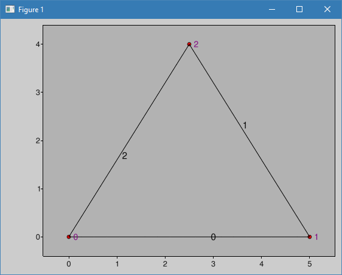
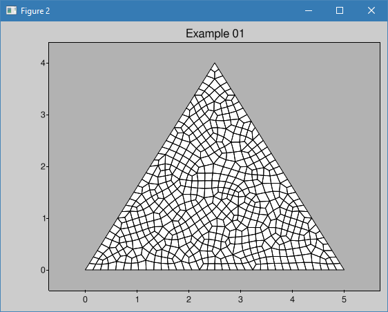
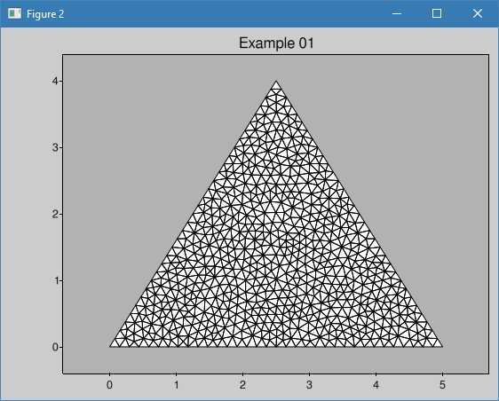

Mesh functions
==============

Included in the Python version of CALFEM is a mesh generation library based on GMSH. The library encapsulates the usage of GMSH transparently for the user. It will also parse the output from GMSH and create the necessary data structures required by CALFEM for solving finite element problems.

To use this functions in Python the mesh modules needs to be imported, which can be done with the following statements:

.. code:: python

    import calfem.geometry as cfg
    import calfem.mesh as cfm

To visualise geometry and meshes we also optionally need the visualisation functions:

.. code:: python
    
    import calfem.vis_mpl as cfv

Mesh generation in CALFEM is divided in three steps:

1.  Defining the geometry of the model.
2.  Creating a finite element mesh with the desired elements and properties
3.  Extracting data structures that can be used by CALFEM.

The following sections describe these steps.

Defining geometry
-----------------

Geometry in CALFEM is described using the **Geometry** class. A
**Geometry**-object will hold all points, lines and surfaces describing
the geometry. This object is also what is passed to the mesh generation
routines in the following sections.

A **Geometry**-object, *g*, is created with the following code:

.. code-block:: python

    g = cfg.Geometry()

This creates a **Geometry** object which will be used to described our
geometry. Next we define the points that will be used to define lines,
splines or ellipses. In this example we define a simple triangle:

.. code-block:: python

    g.point([0.0, 0.0]) # point 0
    g.point([5.0, 0.0]) # point 1
    g.point([2.5, 4.0]) # point 2

The points are connected together with spline-elements. These can have 2
or three nodes. In this case we only use 2 node splines (lines):

.. code-block:: python

    g.spline([0, 1]) # line 0
    g.spline([1, 2]) # line 1
    g.spline([2, 0]) # line 2

Finally we create the surface by defining what lines make up the
surface:

.. code-block:: python

    g.surface([0, 1, 2])

To display our geometry, we use the calfem.vis module:

.. code-block:: python

    cfv.drawGeometry(g)
    cfv.showAndWait()

Running this example will show the following window with a simple
triangle:

Creating a mesh
---------------

To create a mesh we need to create a GmshMesh object and initialize this
with our geometry:

.. code-block:: python

    mesh = cfm.GmshMesh(g)

Next, we need to set some desired properties on our mesh:

.. code-block:: python

    mesh.el_type = 3          # Element type is quadrangle
    mesh.dofs_per_node = 1     # Degrees of freedom per node
    mesh.el_size_factor = 0.15 # Element size Factor

The *el_type* property determines the element used for mesh generation.
Elements that can be generated are:

- 2 - 3 node triangle element
- 3 - 4 node quadrangle element
- 5 - 8 node hexahedron
- 16 - 8 node second order quadrangle

The *dofs_per_node* defines the number of degrees of freedom for each
node. *el_size_factor* determines the coarseness of the mesh.

To generate the mesh and at the same time get the needed data structures
for use with CALFEM we call the **.create()** method of the mesh object:

.. code-block:: python

    coords, edof, dofs, bdofs, elementmarkers = mesh.create()

The returned data structures are:

- coords - Element coordinates
- edof - Element topology
- dofs - Degrees of freedom per node
- bdofs - Boundary degrees of freedom. Dictionary containing the dofs
  for each boundary marker. More on markers in the next section.
- elementmarkers - List of integer markers. Row i contains the marker
  of element i. Can be used to determine what region an element is in.

To display the generated mesh we can use the **drawMesh()** function of
the calfem.vis module:

.. code-block:: python

    cfv.figure()

    # Draw the mesh.

    cfv.drawMesh(
        coords=coords,
        edof=edof,
        dofs_per_node=mesh.dofsPerNode,
        el_type=mesh.elType,
        filled=True,
        title="Example 01"
    )

Running the example will produce the following mesh with quad elements:

Changing the *elType* property to 2 (``mesh.elType = 2``) will produce a
mesh with triangle elements instead:

Specifying boundary markers
---------------------------

To assist in assigning boundary conditions, markers can be defined on
the geometry, which can be used to identify which dofs are assigned to
nodes, lines and surfaces.

In this example we add a marker, 10, to line number 2. Markers are added
as a parameter to the .spline() method of the **Geometry** object as
shown in the following code:

.. code-block:: python

    g.spline([0, 1]) # line 0
    g.spline([1, 2]) # line 1
    g.spline([2, 0], marker=10) # line 2 with marker 10

It is also possible to assign markers to points. The marker parameter is
added to the *.point()* method of the **Geometry** object.

.. code-block:: python

    g.point([0.0, 0.0])             # point 0
    g.point([5.0, 0.0], marker=20)  # point 1
    g.point([2.5, 4.0])             # point 2

In the same way markers can be added to surfaces as well.

Extracting dofs defined by markers
----------------------------------

To extract the dofs defined by the marker we use the *bdofs* dictionary
returned when the mesh was created by the *.create()* method. If we
print the bdofs dictionary we get the following output:

.. code-block:: text

    {20: [2], 0: [1, 2, ... , 67], 10: [1, 3, 68, ... , 98]}

If we examine the output we see that there is a key, 10, containing the
dofs of the number 2 line. We also have the key 20 with a single dof 2
in this case. If the *dofsPerNode* property in the mesh generator was
set to 2 the marker 20 would have contained 2 integers.

For a more complete example see the XXX example.

Function reference
------------------

The following pages summarize selected mesh-related CALFEM functions.

calfem.geometry
~~~~~~~~~~~~~~~

.. include:: mesh_api/calfem_geometry_function_geometry.rst

calfem.mesh
~~~~~~~~~~~

.. include:: mesh_api/calfem_mesh_function_create_mesh.rst
.. include:: mesh_api/calfem_mesh_function_trimesh2d.rst

calfem.utils
~~~~~~~~~~~~

.. include:: mesh_api/calfem_utils_function_apply_bc.rst
.. include:: mesh_api/calfem_utils_function_apply_bc_3d.rst
.. include:: mesh_api/calfem_utils_function_apply_bc_node.rst
.. include:: mesh_api/calfem_utils_function_apply_force_node.rst
.. include:: mesh_api/calfem_utils_function_apply_force.rst
.. include:: mesh_api/calfem_utils_function_apply_traction_linear_element.rst
.. include:: mesh_api/calfem_utils_function_apply_force_3d.rst
.. include:: mesh_api/calfem_utils_function_apply_force_total.rst
.. include:: mesh_api/calfem_utils_function_apply_force_total_3d.rst

calfem.vis_mpl
~~~~~~~~~~~~~~

.. include:: mesh_api/calfem_vis_mpl_function_draw_mesh.rst
.. include:: mesh_api/calfem_vis_mpl_function_draw_elements.rst
.. include:: mesh_api/calfem_vis_mpl_function_draw_node_circles.rst
.. include:: mesh_api/calfem_vis_mpl_function_draw_element_values.rst
.. include:: mesh_api/calfem_vis_mpl_function_draw_displacements.rst
.. include:: mesh_api/calfem_vis_mpl_function_draw_ordered_polys.rst
.. include:: mesh_api/calfem_vis_mpl_function_draw_nodal_values_contourf.rst
.. include:: mesh_api/calfem_vis_mpl_function_draw_nodal_values_contour.rst
.. include:: mesh_api/calfem_vis_mpl_function_draw_nodal_values_shaded.rst
.. include:: mesh_api/calfem_vis_mpl_function_draw_geometry.rst

.. Two dimensional graphics functions
.. ----------------------------------

.. .. include:: dispbeam2.rst
.. .. include:: eldraw2.rst
.. .. include:: eldisp2.rst
.. .. include:: elflux2.rst
.. .. include:: eliso2.rst
.. .. include:: elprinc2.rst
.. .. include:: scalfact2.rst
.. .. include:: scalgraph2.rst
.. .. include:: secforce2.rst
